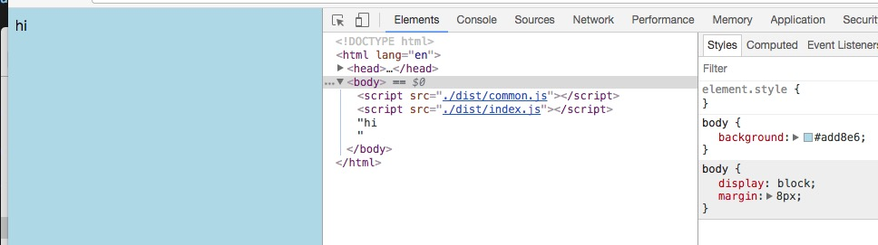
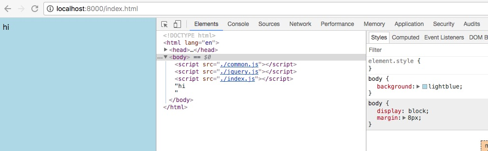
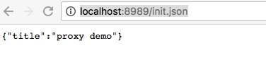
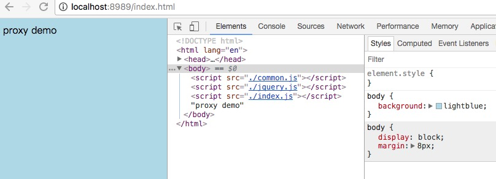
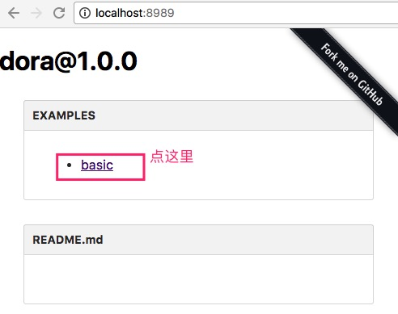
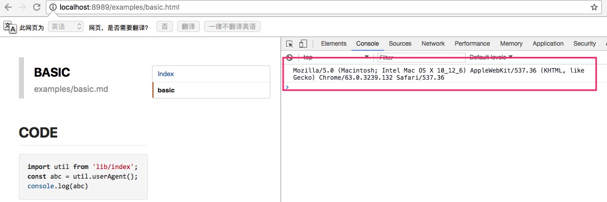
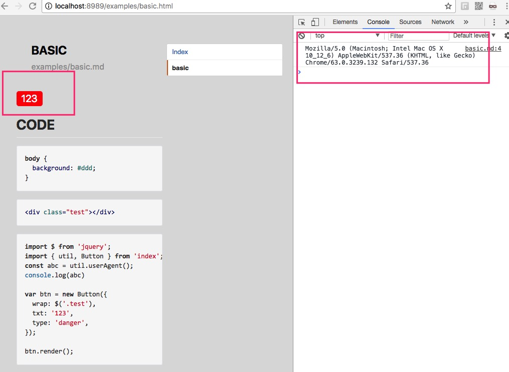

# Ant-Tool

ps: 每一个案例都是根据上一个按钮来继续写的


## 一、atool-build 基本使用
atool-build是对webpack的进一步封装，默认使用的配置文件包含了大部分常用的 webpack 的 loader 和插件，也可以自定义配置，配置的内容和标准的 webpack 不一样。

安装依赖：  
npm install -g atool-build

package.json配置：  
atool-build 要求 package.json 文件里面增加 entry 字段

执行构建：   
$ atool-build  

参数：
+ -o, --output-path <path> 指定构建后的输出路径。
+ -w, --watch [delpay] 是否监控文件变化，默认为不监控。
+ --no-compress 不压缩代码。
+ --config [userConfigFile] 指定用户配置文件。默认为根目录下的 webpack.config.js 文件。这个配置文件不是必须的。
+ --devtool <devtool> 生成 sourcemap 的方法，默认为空，这个参数和 webpack 的配置一致。
+ --hash 使用 hash 模式的构建, 并生成映射表 map.json


默认配置:  
[戳这里](https://site.alipay.net/ant-tool/mobile-docs/webpack-config.html)

其他配置：  
[戳这里](https://site.alipay.net/ant-tool/mobile-docs/spm-to-atool-build.html)


<br>

***

</br>


### 案例1 -- 配置entry,打包js和css

新建文件（目录结构）如下，
```
[demo] // 根目录
  |-- src
    |-- index.js
    |-- index.less
  |-- package.json
  |-- index.html
```

运行 $ npm init

安装依赖 $ npm i atool-build --save-dev

<font color="deeppink">demo/package.json</font>
```json
{
  "name": "demo",
  "version": "1.0.0",
  "description": "",
  "main": "index.js",
  "entry": {
    "index": "./src/index.js"
  },
  "scripts": {
    "test": "echo \"Error: no test specified\" && exit 1"
  },
  "author": "",
  "license": "ISC",
  "devDependencies": {
    "atool-build": "^1.0.2"
  }
}
```

<font color="deeppink">demo/src/index.less</font>
```less
body {
  background: lightblue;
}
```

<font color="deeppink">demo/src/index.js</font>
```javascript
import './index.less';
const init = () => {
  document.write('hi')
}
init();
```

<font color="deeppink">demo/src/index.html</font>
```html
<!DOCTYPE html>
<html lang="en">
<head>
  <meta charset="UTF-8">
  <title>webpackDemo</title>
  <link rel="stylesheet" href="./dist/index.css">
</head>
<body>
</body>
<script src="./dist/common.js"></script>
<script src="./dist/index.js"></script>
</html>
```
注意引入js的时候，common.js要先引入

运行 $ atool-build，生成的文件如下所示
```
[demo]
  |-- dist
    |-- index.js
    |-- index.css
    |-- common.js
```

默认打包到dist文件夹离，并生成index.js（entry里的key）、commons.js（公用）、index.css（index.js里引入了index.less会被打包为index.css）

打开demo/index.html，效果如下



参数的运用，以 -o 举例，运行 $ atool-build -o build，默认到包文件dist里，这里改为打包到build文件夹里

加多个参数 $ atool-build -o build --hash

也可以不全局安装atool-build，修改 `demo/package.json` 的 scripts 如下所示
```json
{
  "scripts": {
    "build": "atool-build",
    "test": "echo \"Error: no test specified\" && exit 1"
  }
}
```
运行 $ npm run build ，也一样能打包

<br>

***

</br>

### 案例2 -- 拷贝html

新增 demo/webpack.config.js，文件目录如下
```
[demo]
  |-- src
    |-- index.js
    |-- index.less
  |-- package.json
  |-- index.html
  |-- webpack.config.js 
```

<font color="deeppink">demo/webpack.config.js</font>
```javascript
var webpack = require('atool-build/lib/webpack');

module.exports = function(webpackConfig) {
  // 拷贝html
  module.exports = function(webpackConfig) {
    webpackConfig.module.loaders.push({ test: /\.html$/, loader: 'file?name=[name].[ext]' })
  
    return webpackConfig;
  };
  // 返回 webpack 配置对象
  return webpackConfig;
};
```

<font color="deeppink">demo/index.html</font>
```html
<!DOCTYPE html>
<html lang="en">
<head>
  <meta charset="UTF-8">
  <title>webpackDemo</title>
  <link rel="stylesheet" href="./index.css">
</head>
<body>
</body>
<script src="./common.js"></script>
<script src="./index.js"></script>
</html>
```

<font color="deeppink">demo/src/index.js</font>
```javascript
require('../index.html');
import './index.less';
const init = () => {
  document.write('hi')
}
init();
```
需要在js里引入一下html

运行 $ atool-build ，运行 $ atool-build ，生成的文件如下所示
```
[demo]
  |-- dist
    |-- index.js
    |-- index.css
    |-- common.js
    |-- index.html
```

打开 dist/index.html 效果和 案例1 一样


<br>

***

</br>


### 案例3 -- common

默认是会打包common.js，不想要common.js的配置如下

<font color="deeppink">demo/webpack.config.js</font>
```javascript
var webpack = require('atool-build/lib/webpack');

module.exports = function(webpackConfig) {
  // 拷贝html
  module.exports = function(webpackConfig) {
    webpackConfig.module.loaders.push({ test: /\.html$/, loader: 'file?name=[name].[ext]' })
  
    return webpackConfig;
  };
  // common
  webpackConfig.plugins.some(function(plugin, i){
    if(plugin instanceof webpack.optimize.CommonsChunkPlugin || plugin.constructor.name === 'CommonsChunkPlugin') {
      webpackConfig.plugins.splice(i, 1);
      return true;
    }
  });
  // 返回 webpack 配置对象
  return webpackConfig;
};
```

<font color="deeppink">demo/index.html</font>
```html
<!DOCTYPE html>
<html lang="en">
<head>
  <meta charset="UTF-8">
  <title>webpackDemo</title>
  <link rel="stylesheet" href="./index.css">
</head>
<body>
</body>
<script src="./index.js"></script>
</html>
```

$ atool-build ，打包结果如下
```
[demo]
  |-- dist
    |-- index.js
    |-- index.css
    |-- index.html
```


<br>

***

</br>


### 案例4 -- 引入jquery并单独打包

$ npm i jqueyr --save-dev

<font color="deeppink">demo/package.json</font>
```json
{
  "name": "dora",
  "version": "1.0.0",
  "description": "",
  "main": "index.js",
  "entry": {
    "index": "./src/index.js",
    "jquery": ["jquery"]
  },
  "scripts": {
    "test": "echo \"Error: no test specified\" && exit 1"
  },
  "author": "",
  "license": "ISC",
  "devDependencies": {
    "atool-build": "^1.0.2",
    "jquery": "^3.2.1"
  }
}
```
entry里需要加入jquery

<font color="deeppink">demo/webpack.config.js</font>
```javascript
var webpack = require('atool-build/lib/webpack');

module.exports = function(webpackConfig) {
  // 拷贝html
  module.exports = function(webpackConfig) {
    webpackConfig.module.loaders.push({ test: /\.html$/, loader: 'file?name=[name].[ext]' })
  
    return webpackConfig;
  };
  // common
  webpackConfig.plugins.some(function(plugin, i){
    if(plugin instanceof webpack.optimize.CommonsChunkPlugin || plugin.constructor.name === 'CommonsChunkPlugin') {
      webpackConfig.plugins.splice(i, 1, new webpack.optimize.CommonsChunkPlugin('jquery', 'jquery.js'));
      return true;
    }
  });
  // 返回 webpack 配置对象
  return webpackConfig;
};
```

new webpack.optimize.CommonsChunkPlugin(A, B))  
A对应的是package.json里entry的key,B是打包的文件名


<font color="deeppink">demo/src/index.js</font>
```js
import $ from 'jquery';
require('../index.html');
import './index.less';
const init = () => {
  $('body').append('hi');
}
init();
```

<font color="deeppink">demo/index.html</font>
```html
<!DOCTYPE html>
<html lang="en">
<head>
  <meta charset="UTF-8">
  <title>webpackDemo</title>
  <link rel="stylesheet" href="./index.css">
</head>
<body>
</body>
<script src="./jquery.js"></script>
<script src="./index.js"></script>
</html>
```

这里要注意jquery.js在index.js之前引用

$ atool-build ，打包结果如下
```
[demo]
  |-- dist
    |-- index.js
    |-- index.css
    |-- index.html
    |-- jquery.js
```

<br>

***

</br>


### 案例5 -- jquery和common都打包出来

<font color="deeppink">demo/webpack.config.js</font>
```javascript
var webpack = require('atool-build/lib/webpack');

module.exports = function(webpackConfig) {
  // 拷贝html
  module.exports = function(webpackConfig) {
    webpackConfig.module.loaders.push({ test: /\.html$/, loader: 'file?name=[name].[ext]' })
    return webpackConfig;
  };
  
  // common
  webpackConfig.plugins.some(function(plugin, i){
    if(plugin instanceof webpack.optimize.CommonsChunkPlugin || plugin.constructor.name === 'CommonsChunkPlugin') {
      webpackConfig.plugins.splice(i, 1, new webpack.optimize.CommonsChunkPlugin({
        names: ["jquery", "common"]
      }));
      return true;
    }
  });
  // 返回 webpack 配置对象
  return webpackConfig;
};
```

new webpack.optimize.CommonsChunkPlugin() 更多参数 [戳这里](http://webpack.github.io/docs/list-of-plugins.html#commonschunkplugin)

<font color="deeppink">demo/index.html</font>
```html
<!DOCTYPE html>
<html lang="en">
<head>
  <meta charset="UTF-8">
  <title>webpackDemo</title>
  <link rel="stylesheet" href="./index.css">
</head>
<body>
</body>
<script src="./common.js"></script>
<script src="./jquery.js"></script>
<script src="./index.js"></script>
</html>
```

注意，上面 CommonsChunkPlugin 里，jquery写在common之前，在 html 里，common.js 应该先引入

$ atool-build ，打包结果如下
```
[demo]
  |-- dist
    |-- index.js
    |-- index.css
    |-- index.html
    |-- jquery.js
    |-- common.js
```

## 二、dora

dora 是一个开发服务器，通过插件的方式集合各种调试方案，比如 webpack、livereload、browsersync、数据 mock、本地代理、weinre、jsonapi 等等。

安装依赖  
$ npm i dora dora-plugin-webpack --save-dev

使用方法  
$ dora --plugins webpack,livereload,jsonapi

载入插件并附加参数  
dora --plugins atool-build?publicPath=/foo/&verbose

载入插件，参数是 JSON 格式  
$ dora --plugins atool-build?{"publicPath":"/foo/","verbose":true}


### 案例6 -- webpack调试

<font color="deeppink">demo/package.json</font>
```json
{
  "name": "dora",
  "version": "1.0.0",
  "description": "",
  "main": "index.js",
  "entry": {
    "index": "./src/index.js",
    "jquery": [
      "jquery"
    ]
  },
  "scripts": {
    "start": "dora --plugins webpack",
    "build": "atool-build",
    "test": "echo \"Error: no test specified\" && exit 1"
  },
  "author": "",
  "license": "ISC",
  "devDependencies": {
    "atool-build": "^1.0.2",
    "dora": "^0.5.0",
    "dora-plugin-webpack": "^1.0.0",
    "jquery": "^3.2.1"
  }
}
```

运行 $ npm run start , 打开 http://localhost:8000/index.html , 效果如下




<br>

***

</br>


### 案例7 -- 本地数据 mock

$ npm i dora-plugin-proxy -D

参数:
  + port : 代理服务器端口号
  + watchDirs : 定义哪些目录下的规则定义可以实时刷新
  + watchDelay : 目录监听延迟，默认：300 毫秒

新增 proxy.config.js , 如下
```
[demo]
  |-- src
    |-- index.js
    |-- index.less
  |-- package.json
  |-- index.html
  |-- webpack.config.js 
  |-- proxy.config.js
```

<font color="deeppink">demo/proxy.config.js</font>
```js
module.exports = {
  'GET /init.json': {
    title: 'proxy demo'
  }
}
```

proxy.config.js 的写法 [戳这里](https://github.com/dora-js/dora-plugin-proxy)

<font color="deeppink">demo/package.json</font>
```js
{
  "name": "dora",
  "version": "1.0.0",
  "description": "",
  "main": "index.js",
  "entry": {
    "index": "./src/index.js",
    "jquery": [
      "jquery"
    ]
  },
  "scripts": {
    "start": "dora --plugins webpack,proxy",
    "build": "atool-build",
    "test": "echo \"Error: no test specified\" && exit 1"
  },
  "author": "",
  "license": "ISC",
  "devDependencies": {
    "atool-build": "^1.0.2",
    "dora": "^0.5.0",
    "dora-plugin-proxy": "^0.8.5",
    "dora-plugin-webpack": "^1.0.0",
    "jquery": "^3.2.1"
  }
}
```

$ npm start , 打开 http://localhost:8989/init.json 效果如下



<font color="deeppink">demo/src/index.js</font>
```js
import $ from 'jquery';
import '../index.html';
import './index.less';

const init = () => {
  $.ajax({
    url: '/init.json',
    data: {},
    type: 'GET',
    success: (d = {}) => {
      if (d.title) {
        $('body').append(d.title);
      } else {
        $('body').append('title');
      }
    },
    error: () => {
      $('body').append('ajax error');
    }
  })
}

init();
```

打开 http://localhost:8989/index.html , 效果如下




参数的使用，这里以port举例，demo/package.json
```js
{
  "scripts": {
    "start": "dora --plugins webpack,proxy?port=7777",
    "build": "atool-build",
  }
}
```
打开 http://localhost:7777/ 看效果


<br>

***

</br>


### 案例8 -- 实时刷新

$ npm i dora-plugin-livereload -D

<font color="deeppink">demo/package.json</font>
```json
{
  "name": "dora",
  "version": "1.0.0",
  "description": "",
  "main": "index.js",
  "entry": {
    "index": "./src/index.js",
    "jquery": [
      "jquery"
    ]
  },
  "scripts": {
    "start": "dora --plugins webpack,proxy,livereload",
    "build": "atool-build",
    "test": "echo \"Error: no test specified\" && exit 1"
  },
  "author": "",
  "license": "ISC",
  "devDependencies": {
    "atool-build": "^1.0.2",
    "dora": "^0.5.0",
    "dora-plugin-livereload": "^0.6.0",
    "dora-plugin-proxy": "^0.8.5",
    "dora-plugin-webpack": "^1.0.0",
    "jquery": "^3.2.1"
  }
}
```

打开 http://localhost:8989/index.html , 并动态 demo/src/index.js , 效果如下


<br>

***

</br>


## 三、npm 发布

atool-doc
是一个面向组件的静态 Demo 生成、调试工具
  - 本地写个 Demo 看看组件使用效果
  - 本地看 Demo 的时候顺便调个试
  - 将 Demo 打包成静态文件发给别人，或者部署到服务器在线访问


```
├── .eslintrc
├── .si.yml
├── HISTORY.md
├── Makefile
├── README.md
├── examples
│   ├── example-a.md
│   └── example-b.md
├── gitignore
├── index.js
├── info.md
├── package.json
├── src
│   ├── component.js
│   ├── index.js
│   └── index.less
├── tests
│   └── index-test.js
└── webpack.config.js
```


- .eslintrc ESLint 代码规范检测.
- .si.yml 如果该组件发布至内网，同时需要该组件的文档自动同步至 Si 那么请在该基础上修改相关内容，如果发布至 npm 请删除该文件
- HISTORY.md 组件日志发布历史
- Makefile makefile，使用 make publish 发布至 npm，使用 make publish-sync 发布至 npm 并同步 cnpm 和 tnpm
- README.md 组件的说明文档
- examples 文档文件存放处
- .gitignore 设置 git 忽略的文件
- index.js 组件入口
- info.md 组件最佳实践文档
- package.json
- src 源码目录
- tests 测试用例目录，请用 *-test.js 或 *-spec.js
- webpack.config.js atool-build 所需的自定义构建描述，通常用以构建发布至 cdn 所需


package.json
```json
"scripts": {
  "compile": "rm -rf lib && babel src --out-dir lib && lessc src/index.less lib/index.css",
  "build": "atool-build",
  "lint": "eslint --ext .js src",
  "test": "atool-test",
  "doc": "atool-doc",
  "doc-build": "atool-doc --build",
  "gh-pages": "atool-doc --build && gh-pages -d __site"
},
"main": "./lib/index",
"entry": {
  "index": "./index"
}
```

- compile es6 -> es5, less -> css
- build 自定义构建，通常用以构建发布至 cdn 所需
- lint run eslint
- test run test cases
- doc run doc server
- doc-build run doc build
- gh-pages 把 atool-dooc 构建后的 __site/ 目录发布 github gh-pages

osx:  
rm -rf lib && babel src --out-dir lib && lessc src/index.less lib/index.css && cp src/iconfont.ttf lib/"

win:  
rmdir /S lib && mkdir lib && babel src --out-dir lib && lessc src/index.less lib/index.css && xcopy .\\src\\feedback.atpl .\\lib\\feedback.atpl

如果你的仓库需要发布至内网请在 pkg.name 中添加 namespace 例如： @alipay/componeng-example

并且在 pkg 中新建一个字段 publishConfig
```js
"publishConfig":{
  "registry": "http://registry.npm.alibaba-inc.com"
}
```

目录中 .si.yml 在同步 si 静态服务所用， 如果发布至 npm 的包可以使用 gh-pages 即可以删除该文件。


布流程
- npm run build
- npm run compile
- npm publish


<br>

***

</br>


### 案例9 -- 组件 js

新建项目
```
[demo]
  |-- HISTORY.md
  |-- Makefile
  |-- README.md
  |-- examples
    |-- basic.md
  |-- .gitignore
  |-- index.js
  |-- info.md
  |-- package.json
  |-- src
    |-- index.js
  |-- tests
    |-- index-test.js
  |-- webpack.config.js
```

<font color="deeppink">demo/package.json</font>
```json
{
  "name": "demo",
  "version": "1.0.0",
  "description": "",
  "main": "./lib/index",
  "entry": {
    "index": "./index"
  },
  "scripts": {
    "compile": "rm -rf lib && babel src --out-dir lib",
    "build": "atool-build",
    "lint": "eslint --ext .js src",
    "test": "atool-test",
    "doc": "atool-doc",
    "doc-build": "atool-doc --build",
    "gh-pages": "atool-doc --build && gh-pages -d __site"
  },
  "author": "",
  "license": "ISC",
  "devDependencies": {
    "atool-build": "^1.0.2",
    "atool-doc": "^0.9.1",
    "atool-test": "^0.5.5",
    "babel-cli": "^6.26.0"
  }
}
```

<font color="deeppink">demo/webpack.config.js</font>
```js
var webpack = require('atool-build/lib/webpack');

module.exports = function(webpackConfig) {
  // common
  webpackConfig.plugins.some(function(plugin, i){
    if(plugin instanceof webpack.optimize.CommonsChunkPlugin || plugin.constructor.name === 'CommonsChunkPlugin') {
      webpackConfig.plugins.splice(i, 1);
      return true;
    }
  });
  // 返回 webpack 配置对象
  return webpackConfig;
};
```

<font color="deeppink">demo/index.js</font>
```js
import utils from './src/';

export default utils;
```

<font color="deeppink">demo/.gitignore</font>
```
dist/
node_modules/
www/
coverage/
__site/
npm-debug.log
.DS_Store
```

<font color="deeppink">demo/src/index.js</font>
```js
const util = {
  userAgent: () => navigator.userAgent,
  appName: () => navigator.appName,
  appVersion:() => navigator.appVersion,
}

export default util;
```

<font color="deeppink">demo/examples/basic.md</font>

```js
（这里用 "."代替 "`"）

## code
··· js
import util from 'lib/index';
const abc = util.userAgent();
···
```

$ npm i

$ npm run compile

$ npm run doc , 打开 http://localhost:8989/ ，效果如下






<br>

***

</br>


### 案例10 -- 组件 less

新增文件如下
```
[demo]
  |-- src
    |-- button.js
    |-- util.js
    |-- index.less
```

<font color="deeppink">demo/package.json</font>
```json
{
  "name": "dora",
  "version": "1.0.0",
  "description": "",
  "main": "./lib/index",
  "entry": {
    "index": "./index"
  },
  "scripts": {
    "compile": "rm -rf lib && babel src --out-dir lib && lessc src/css/index.less lib/css/index.css",
    "build": "atool-build",
    "lint": "eslint --ext .js src",
    "test": "atool-test",
    "doc": "atool-doc",
    "doc-build": "atool-doc --build",
    "gh-pages": "atool-doc --build && gh-pages -d __site"
  },
  "author": "",
  "license": "ISC",
  "devDependencies": {
    "atool-build": "^1.0.2",
    "atool-doc": "^0.9.1",
    "atool-test": "^0.5.5",
    "babel-cli": "^6.26.0",
    "babel-plugin-add-module-exports": "^0.2.1",
    "babel-preset-es2015": "^6.24.1",
    "babel-preset-stage-0": "^6.24.1"
  },
  "dependencies": {
    "jquery": "^3.3.1"
  },
  "babel": {
    "presets": [
      "es2015",
      "stage-0"
    ],
    "plugins": [
      "add-module-exports"
    ]
  }
}
```


<font color="deeppink">demo/src/util.js</font>
```js
const util = {
  userAgent: () => navigator.userAgent,
  appName: () => navigator.appName,
  appVersion:() => navigator.appVersion,
}

export default util;
```


<font color="deeppink">demo/src/button.js</font>
```js
import $ from 'jquery';

class Bottom {
  constructor(opts = {}) {
    this.wrap = opts.wrap || $('body');
    this.txt = opts.txt || '按钮';
    this.type = opts.type || 'normal'
  }
  render() {
    this.wrap.append(`<div class="btn ${this.type}">${this.txt }</div>`);
  }
}

export default Bottom;
```

<font color="deeppink">demo/src/index.less</font>
```less
.btn {
  display: inline-block;
  padding: 5px 10px;
  font-size: 20px;
  line-height: 1;
  color: #fff;
  border-radius: 5px;
}
.normal {
  background: rgb(48, 120, 230);
}
.danger {
  background: red;
}
.wran {
  background: orange;
}
```

<font color="deeppink">demo/src/index.js</font>
```js
import util from './util';
import Button from './button';

export default {
  util,
  Button,
};
```

<font color="deeppink">demo/index.js</font>
```js
import utils from './src/index';
import './src/index.less';

export default utils;
```

<font color="deeppink">demo/examples/basic.md</font>
```js
（这里用 "."代替 "`"）

## code

···css
body {
  background: #ddd;
}
···

···html
<div class="test"></div>
···

···js
import $ from 'jquery';
import { util, Button } from 'index';
const abc = util.userAgent();
console.log(abc)

var btn = new Button({
  wrap: $('.test'),
  txt: '123',
  type: 'danger',
});

btn.render();
···
```

$ tnpm i

$ npm run doc , 打开 http://localhost:8989/examples/basic.html ，效果如下




<br>

***

</br>


### 案例11 -- 组件 atpl

新增文件如下
```
[demo]
  |-- src
    |-- button.atpl
```

<font color="deeppink">demo/package.json</font>
```json
{
  "name": "dora",
  "version": "1.0.0",
  "description": "",
  "main": "./lib/index",
  "entry": {
    "index": "./index"
  },
  "scripts": {
    "compile": "rm -rf lib && babel src --out-dir lib && lessc src/css/index.less lib/css/index.css && cp ./src/button.atpl ./lib/button.atpl",
    "build": "atool-build",
    "lint": "eslint --ext .js src",
    "test": "atool-test",
    "doc": "atool-doc",
    "doc-build": "atool-doc --build",
    "gh-pages": "atool-doc --build && gh-pages -d __site"
  },
  "author": "",
  "license": "ISC",
  "devDependencies": {
    "atool-build": "^1.0.2",
    "atool-doc": "^0.9.1",
    "atool-test": "^0.5.5",
    "atpl-loader": "^0.2.0",
    "babel-cli": "^6.26.0",
    "babel-plugin-add-module-exports": "^0.2.1",
    "babel-preset-es2015": "^6.24.1",
    "babel-preset-stage-0": "^6.24.1"
  },
  "dependencies": {
    "jquery": "^3.3.1"
  },
  "babel": {
    "presets": [
      "es2015",
      "stage-0"
    ],
    "plugins": [
      "add-module-exports"
    ]
  }
}
```

<font color="deeppink">demo/webpack.config.js</font>
```js
var webpack = require('atool-build/lib/webpack');

module.exports = function(webpackConfig) {
  // common
  webpackConfig.plugins.some(function(plugin, i){
    if(plugin instanceof webpack.optimize.CommonsChunkPlugin || plugin.constructor.name === 'CommonsChunkPlugin') {
      webpackConfig.plugins.splice(i, 1);
      return true;
    }
  });
  // atpl loader
  webpackConfig.module.loaders.push({
    test: /\.atpl?$/,
    loader: 'atpl-loader',
  });
  // 返回 webpack 配置对象
  return webpackConfig;
};
```

<font color="deeppink">demo/src/button.atpl</font>
```html
<div class="btn <%=type%>">
  <%=txt%>
</div>
```

<font color="deeppink">demo/src/button.js</font>
```js
import $ from 'jquery';
import btnTpl from './button.atpl';

class Bottom {
  constructor(opts = {}) {
    this.wrap = opts.wrap || $('body');
    this.txt = opts.txt || '按钮';
    this.type = opts.type || 'normal';
  }
  render() {
    const tpl = btnTpl({
      type: this.type,
      txt: this.txt,
    })
    this.wrap.append(tpl);
  }
}

export default Bottom;
```

$ npm run doc , 打开 http://localhost:8989/examples/basic.html ，效果和 案例10 一样


<br>

***

</br>


### 案例12 -- 组件 react

删除下面文件
```
[demo]
  |--src
    |--button.atpl
```

<font color="deeppink">demo/package.json</font>
```json
{
  "name": "dora",
  "version": "1.0.0",
  "description": "",
  "main": "./index",
  "entry": {
    "index": "./index"
  },
  "scripts": {
    "compile": "rm -rf lib && babel src --out-dir lib && lessc src/index.less lib/index.css",
    "build": "atool-build",
    "lint": "eslint --ext .js src",
    "test": "atool-test",
    "doc": "atool-doc",
    "doc-build": "atool-doc --build",
    "gh-pages": "atool-doc --build && gh-pages -d __site"
  },
  "author": "",
  "license": "ISC",
  "devDependencies": {
    "atool-build": "^1.0.2",
    "atool-doc": "^0.9.1",
    "atool-test": "^0.5.5",
    "atpl-loader": "^0.2.0",
    "babel-cli": "^6.26.0",
    "babel-plugin-add-module-exports": "^0.2.1",
    "babel-preset-es2015": "^6.24.1",
    "babel-preset-react": "^6.24.1",
    "babel-preset-stage-0": "^6.24.1"
  },
  "dependencies": {
    "react": "^16.2.0",
    "react-dom": "^16.2.0"
  },
  "babel": {
    "presets": [
      "es2015",
      "react",
      "stage-0"
    ],
    "plugins": [
      "add-module-exports"
    ]
  }
}
```

<font color="deeppink">demo/webpack.config.js</font>
```js
var webpack = require('atool-build/lib/webpack');

module.exports = function(webpackConfig) {
  // common
  webpackConfig.plugins.some(function(plugin, i){
    if(plugin instanceof webpack.optimize.CommonsChunkPlugin || plugin.constructor.name === 'CommonsChunkPlugin') {
      webpackConfig.plugins.splice(i, 1);
      return true;
    }
  });
  // 返回 webpack 配置对象
  return webpackConfig;
};
```


<font color="deeppink">demo/src/button.js</font>
```js
import React, { Component } from 'react';

export default class Bottom extends Component {
  constructor(props) {
    super(props);
  }
  render() {
    const {
      opts,
    } = this.props;
    const {
      txt = '',
      type = 'normal',
    } = opts;
    return (
      <div className={`btn ${type}`}>{txt}</div>
    )
  }
}
```


<font color="deeppink">demo/examples/basic.md</font>
```js
（这里用 "."代替 "`"）

## code

···css
body {
  background: #ddd;
}
···

···html
<div id="test"></div>
···

···js
import React from 'react';
import ReactDOM from 'react-dom';
import { util, Button } from 'index';
const abc = util.userAgent();
console.log(abc)

ReactDOM.render(
  <Button opts={{type:'danger',txt:'按钮'}} />,
  document.getElementById('test'),
)
···
```

$ npm run doc , 打开 http://localhost:8989/examples/basic.html ，效果和 案例10 一样


-------
-------

<br>

***

</br>

## 三、
### 案例12